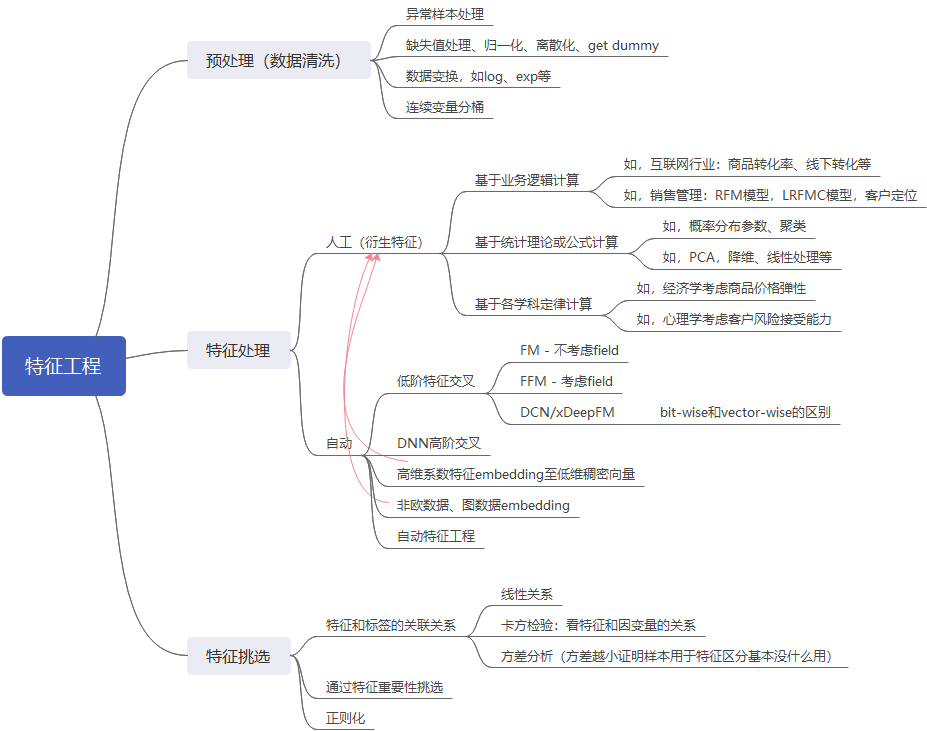

#### Thinking 1: CTR数据中的类别数据处理，编码方式有哪些，区别是什么

**类别数据可以进行label encode或one hot encode：**

1. label encode是针对不重复的变量分别从0开始更新特征值（可以自定义），即用标签进行编码，label encode后特征仅更新原特征值，不增加特征数

2. One hot encode是以目标特征值作为新特征，用0/1代表对应样本是否拥有该特征。

**优缺点对比：**

1. One hot encode等同于通过原始特征值转化为高维向量，扩充了特征，对比Label encode拥有更强的特征表达能力。但当类别数量太多的时候，可能会造成维度爆炸。

2. Label encode解决了分类编码的问题，但数字标签本身没有异议，可解释性也比较差，所以这既是优点也是缺点。

除此之外，还可以有hash encoding，polynomial encoding，label-count等类型的encoding方法。

#### Thinking 2: 对于时间类型数据，处理方法有哪些

1. 按可解释的粒度进行拆分，如：年，月，日，时，分，秒，季度，工作日，周末，特殊节假日
2. 如果有log日志，可计算新特征，如：距离当前时间的跨度，session首尾跨度，最后一次和倒数第二次的时间跨度等
3. 时序数据处理：针对多次时间可计算多次出现的物理含义（按场景，比如浏览商品（action 1）和点击购买（action 2）之间的时间间隔，不同长短可能有不同的物理含义）

#### Thinking 3: 你是如何理解CTR预估中的特征组合的，请举例说明

CTR中的特征组合所产生的特征强度影响最终模型的效果。针对某个行业的人工特征组合需要比较深入的对行业的了解，比如针对客户管理，可以计算RFM模型值作为特征，银行的线上商城或许可以把会员使用信用卡积分的积极性（频次）作为特征去评判如何做画像。这些人工特征往往可以通过一些行业经验和统计方式进行计算。

但是，人工特征的效率不高，所以研究人员推出类似FM DeepFM XDeepFM 和DCN类型的自动交叉特征组合以及高阶特征组合方法，弥补人工特征的效率和覆盖面的问题，同时也解决了高维稀疏特征的处理问题。但个人觉得自动二阶特征和高阶特征仍然面临需要被二次人工筛选的效率问题。

#### Thinking 4: DCN和xDeepFM都可以进行自动特征组合，有何区别

DCN 和 xDeepFM 的相同点是，DNN部分是一样的，不同的地方在于 DCN 的 Cross 部分使用的是 bit-wise的 CrossNet 网络，而 xDeepFM 使用的CIN网络是 vector-wise 的。

DCN 认为关联特征和label的正向性是普遍存在的，所以需要考虑特征之间是否关联，并以此作为一种新的交叉网络，在每个层上明确地应用交叉特征，有效地学习有界度的预测交叉特征，并且不需要人工特征。

xDeepFM 通过 vector-wise的方式补足了DCN在cross层只考虑bit-wise的缺点，增加了field的认知。

#### Thinking 5: 今天讲解的特征组合只是特征工程中的一部分，你理解的特征工程都包括哪些，不防做个思维导图

如果无法显示，请查看附件“fe.png”

